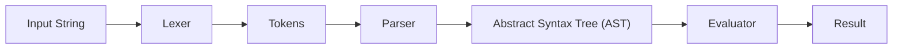
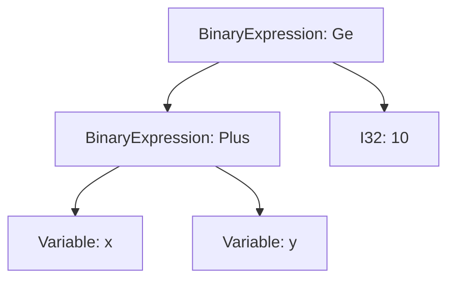

+++
title= "Lexing and Parsing"
date= 2024-11-17
template= "post.html"
math= "katex" 
tags = ["programming languages", "compilers"]
# hideToc = true
draft= true
+++

Lexing and parsing are foundational steps in implementing a programming language or domain-specific language (DSL). These don’t need to be limited to compiled or interpreted general-purpose languages; they’re equally relevant for DSLs like SQL, JSON, or even custom languages for specific use cases.

I’ve noticed a recurring pattern in my projects: many of them require some form of lexer or parser. Whether it's creating a query language for a database, designing a formula parser for expressions, or building a user-extensible modular system for my data pipeline, I often hit a roadblock at the lexing and parsing phase.

Enough is enough. I’ve decided to tackle this head-on and finally implement a solid lexer and parser. My goal is to write a comprehensive blog post documenting the process—something I can reference for future projects and that might help others facing similar challenges.

## Basic outlines

The basic phases of any language implementation involves the following phases:



Each phase is a successive "lowering", i.e. we go from the form that can be the most ambigious, human-friendly, to the form that is easily-processable by computers. One would start with these phases by first thinking about how they would like to represent a query. I like to do this from reverse, i.e. represent the inputs to the evaluator, and going from there.

## Representing inputs

We can start to think about our programming language implementation either from the Lexing or the Evaluation phase from the diagram above. In my case, I will do it from the reverse, i.e. evaluation phase.

### Representing expressions

Imagining that we are writing a simple DSL that can process queries like $ x + y \ge 10$, we can think about the expressions as having the following components:

- at least one operand
- one operator

This would be represented in Rust using an enum, something like this:

```rust
enum Expression {
    I32(i32),
    Variable(String),
    BinaryExpression {
        op: Operator,
        lhs: Box<Expression>,
        rhs: Box<Expression>
    }
}
```

I say at least one operator, because instead of having `lhs`, `rhs`, we could have a `Vec<Expression>` instead like when we are evaluating lisp expressions.

And the accompanying `Operator` could be

```rust
enum Operator {
    Lt,
    Gt,
    Le,
    Ge,
    Eq,
    Ne
}
```

Both of these can have extensions like `functionCall` for `Expression`, and boolean operators in the `Operator` enum according to need. One of the nice things about representing types backwards is the reduced cognitive overhead of thinking about the "grammar" of the language and lexing/parsing specifics, i.e. you do not lose focus of the big-picture stuff while tinkering with the parsing logic.


### Representing ASTs

The types above are the nodes of a conceptual AST we would like to evaluate at the end of the day. The AST could look something like this:



### Representing Grammar

The grammar for this very simple expression can be represented as follows:

```plaintext
Expression -> Expression '+' Expression
                | Expression '-' Expression
                | Expression '*' Expression
                | Expression '/' Expression
                | Expression '<' Expression
                | Expression '>' Expression
                | Expression '<=' Expression
                | Expression '>=' Expression
                | I32
                | Variable

Variable -> ["a-zA-Z_"]["a-zA-Z_0-9"]*
I32 -> [1-9][0-9]*
```

The stuff on the LHS before the `->` is a "Rule", also called as a nonterminal. The stuff on the RHS is the rule
description, with each possible expansion of the rule. An observation to be made is that the rules can be defined in terms of themselves. In our case, most rules are both _left-recursive_ and _right-recursive_. We will take care of this in the parsing part.

## Processing strings and expressions

This part starts from the left side of the graph and proceeds successively to the right, producing the intermediate artifacts. For e.g. it takes the input from the user as a string and lowers it into structs that can then be evaluated.

### Processing tokens: Lexing

Everything in a string is made up of tokens. These can be easily seen from the grammar above, where the variable rule defines a string of characters as the only valid expansion, and so does the I32 rule. Looking closely, we can see that all rules _must_ eventually boil down to producing string characters (or validating them), which produces a valid program. So the first step is to convert the input string into tokens. This process is also callled Lexing.

I am not going to talk about regular expressions or DFAs in this section, it is left as an exercise to the reader to implement. The way a lexer works is as follows:

1. Maintain a "combined" regular expression (in Rust, this can be accomplished using a [RegexSet](https://docs.rs/regex/latest/regex/struct.RegexSet.html)) that can match an incoming input stream.
2. Match the input stream with the regular expression and check which rule(s) it matched.
3. If it matches more than one rule, take the rule that matches the longest string. Else, take the first rule that matches.
4. If no rule matches, throw an error: nothing can be matched at that point.

First, we define the tokens that we can match. These must be sorted in order of precedence. For e.g. 'if' could be a keyword, but it could also be a variable name. We must decide which one to match first.

```rust
enum TokenType {
    KwIf,
    Identifier
    Number,
    Plus,
    Times,
    Minus
}
```

All of these types must have a corresponding regular expression that can match them. For e.g. the regular expression for `Number` could be `[0-9]+`, and for `Identifier` could be `[a-zA-Z_][a-zA-Z_0-9]*`. The regular expressions for the other types can be easily derived from the grammar above.

```rust
fn get_regex_from_tokentype (token_type: TokenType) -> Regex {
    match token_type {
        TokenType::KwIf => Regex::new(r"if").unwrap(),
        TokenType::Identifier => Regex::new(r"[a-zA-Z_][a-zA-Z_0-9]*").unwrap(),
        TokenType::Number => Regex::new(r"[0-9]+").unwrap(),
        TokenType::Plus => Regex::new(r"\+").unwrap(),
        TokenType::Times => Regex::new(r"\*").unwrap(),
        TokenType::Minus => Regex::new(r"-").unwrap()

        _ => panic!("Unknown token type")
    }
}
```

I can use `panic!()` because this is a tutorial/note. More graceful methods must be employed to handle this, perhaps using a custom error type with `ThisError` crate that we all know and love.

Next, we define the notion of a "Token". The token represents a sequence of characters, with an assigned type, and a position in the input stream.

```rust
struct Token {
    token_type: TokenType,
    value: String,
    position: usize
}
```

The implementation of the lexer itself is very simple

```rust
fn lex(input: &str) -> Vec<Token> {
    let mut tokens = Vec::new();
    let mut position = 0;
    while position < input.len() {
        let mut matched = false;
        for token_type in TokenType::iter() {
            let regex = get_regex_from_tokentype(token_type);
            if let Some(m) = regex.find(&input[position..]) {
                tokens.push(Token {
                    token_type,
                    value: m.as_str().to_string(),
                    position
                });
                position += m.end();
                matched = true;
                break;
            }
        }
        if !matched {
            panic!("No token matched at position {}", position);
        }
    }
    tokens
}
```

Et voila! We have a lexer that can convert an input string into tokens. The next step is to convert these tokens into an AST, which is the subject of the next section.

## Lowering further into AST

In order to parse our grammar rules into a AST structure, we need a parser. The parser takes in a stream of tokens and converts them into a tree structure. The tree structure is defined by the grammar rules, and the parser must be able to recognize these rules in the token stream. In order to parse stuff, we first need to define what to parse _from_ and what to parse _to_. The from part is down - it is the tokens. The to part is the AST. We have already defined the AST structure above, so we can start with the parsing logic.

Let's define our expression struct first

```rust
enum Expression {
    I32(i32),
    Variable(String),
    BinaryExpression {
        op: Operator,
        lhs: Box<Expression>,
        rhs: Box<Expression>
    }
}
```

Since rust structs cannot be self-referential, we use `Box` to create a reference to the struct. This is a common pattern in Rust, and is used to avoid the struct being infinitely large.

Next, we arrive to the dreaded part - parsing the token stream to the AST. This is where the rubber meets the road. The parser must be able to recognize the grammar rules in the token stream, and convert them into the AST. The parser is a recursive descent parser, which means that it is a top-down parser that starts from the root of the grammar and proceeds to the leaves.

An example of parsing an expression, looking at our grammar, would be something like this:

```rust
fn parse_expression() -> Result<Expression, String> {
    let lhs = parse_expression();
    let op = parse_operator();
    let rhs = parse_expression();
    
    Ok(Expression::BinaryExpression {
        op,
        lhs: Box::new(lhs),
        rhs: Box::new(rhs)
    })
}
```

Wait what. This is a recursive function. It calls itself. This is a problem.

In order to solve this problem, people have come up with pretty smart ways. You could convert this to a right-recursive grammar, use the shift-reduce approach, write a PEG grammar, use a parser-combinator library, or use an operator-precedence parser. All of these approaches have their pros and cons:

1. Conversion to right-recursive grammar causes the grammar to lose it's easy-to-understand semantics.
2. Shift-reduce approach is a stack-based way to reduce token streams to rules. It is a very powerful algorithm, but it is not very readable. Plus, if you have two subrules that reduce to the same rule, you need a way to resolve the ambiguity.
3. PEG grammars are very powerful, but they are not very readable. They are also not very easy to write by hand.
4. Parse-combinator libraries all use their own "abstraction"s and have their own DSLs. You'd have to learn new stuff to use them.
5. Operator-precedence parsers are a very simple way to parse expressions. They are very easy to write by hand, and are very readable. They are also very powerful.

I love the pratt-parsing technique outlined in blog posts [here](https://matklad.github.io/2020/04/13/simple-but-powerful-pratt-parsing.html), [here](https://journal.stuffwithstuff.com/2011/03/19/pratt-parsers-expression-parsing-made-easy/) and [here](https://martin.janiczek.cz/2023/07/03/demystifying-pratt-parsers.html). Although matklad and nystrom are giants in their own right, I love how martin explains the algorithm - I instantly understood it.

So basically for pratt-parsing expressions, you do not care about "expression"s at all. You only care about "atoms" and "prefix" and "infix" operators. The atoms are the base cases, and the prefix and infix operators are the recursive cases. A naive recursive-descent expression-parsing algorithm could look like this for infix expressions:

1. Parse an atom
2. Look ahead in the token stream for the next token. If it is not an operator, we are done! Return the atom (i32, variable, etc) as an expression.
3. If the next operator is a valid operator, then parse the content after the operator as an expression. This is the recursive part. Combine the atom, the operator, and the expression into a single binary expression, and return it.

However, there's a bug with this approach - can you find it?

> Imagine running this on an expression like $ 1 + 2 * 3 - 4$. The algorithm would parse this as $ (1 + (2 * (3 - 4)))$.

So the real issue here is with the precedence of the operators. The algorithm does not know which operator to parse first. This is where the pratt-parsing algorithm shines. It allows you to define the precedence of the operators, and parse them accordingly. A portion of the algorithm is as follows:

```python
def pratt_parse(input: List[str], precedence = 0): 
    token = input.pop(0)
    left = parse_atom(token)
    while input and precedence <= get_precedence(input[0]):
        token = input.pop(0)
        left = expression(left, token, pratt_parse(input, get_precedence(token)))
    return left
```

This part of the pratt parser does the "collection" - it keeps on collecting expressions into the lhs as we normally would. Notice the `get_precedence(input[0])`. This means 

> While the operator we are seeing has a precedence lower than or equal to the precedence of the operator we are currently parsing, keep on collecting the expressions.

Let's consider this in the context of the expression $ 1 + 2 * 3 - 4$. The precedence of `+` is lower than `*`, so we keep on collecting the expressions until we reach the `-` operator. This leaves us with the expression $ (1 + (2 * 3))$.

The second important part happens when the precedence becomes smaller than the operator we were working with. In that case, we return the expression we have collected so far. This is the "termination" part of the algorithm.

```python